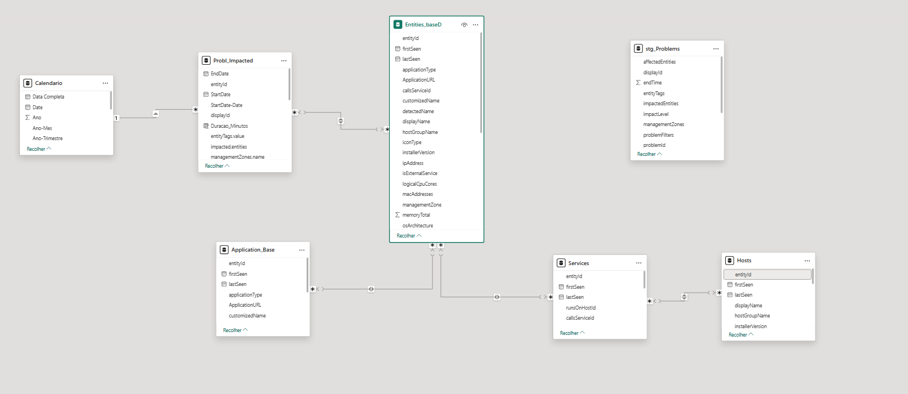

Entities_baseD [entityID] **---** Probl_Impacted [entityID] / Services_Base [entityID] / Application_Base [entityID]

Services_Base [runsOnHostId] **---** Hosts_Base [entityID]

Probl_Impacted [StartDate] **---1 Calendário [Date]

